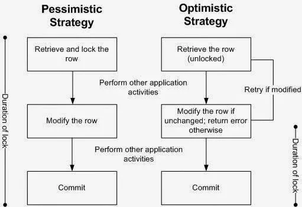

# Concurency control POC in Java Spring Boot 

The goal of this POC is to compare differnet concurency control techniques available in Spring Boot

## Startup 

- Use `docker compose up` to start the Postgres database container 
- Start the `ConcurrencyControlApplication` locally 
- Run `EndPointTest`

## Tested techniques 

### No strategy
Baseline

### Optimistic Strategy 

JPA: Use the `@Version` annotation on an entity to mark it as versioned.

VersionProduct will apply (Database Level → Optimistic Lock) using @Version

### Pesimistic Strategy 
JPA: `@Transactional` how about this????

#### Memory Level
SyncProduct, I will apply (Memory Level → Pessimistic Lock) using synchronized

##### Synchronized blocks or methods will not work properly in a distributed microservices environment with multiple replicas.

#### Database Level
LockProduct, I will apply (Database Level → Pessimistic Lock) using @Lock(LockModeType.PESSIMISTIC_WRITE)
